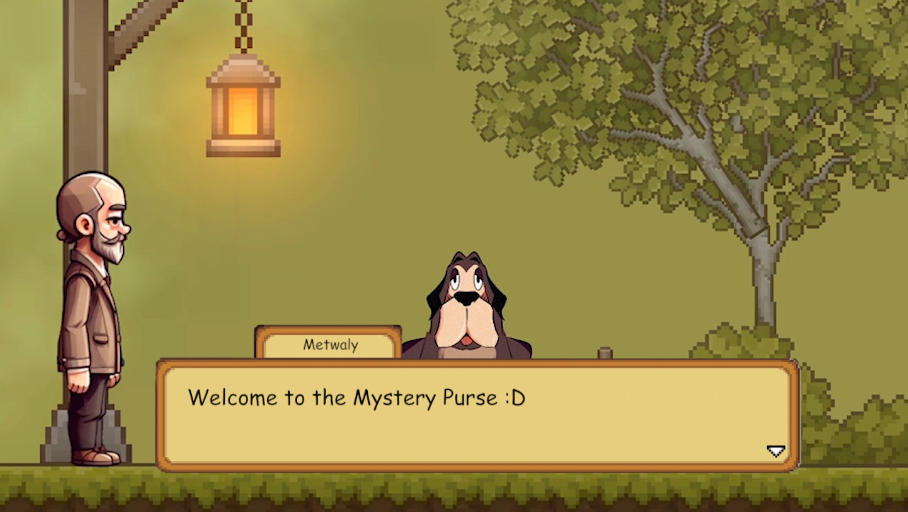
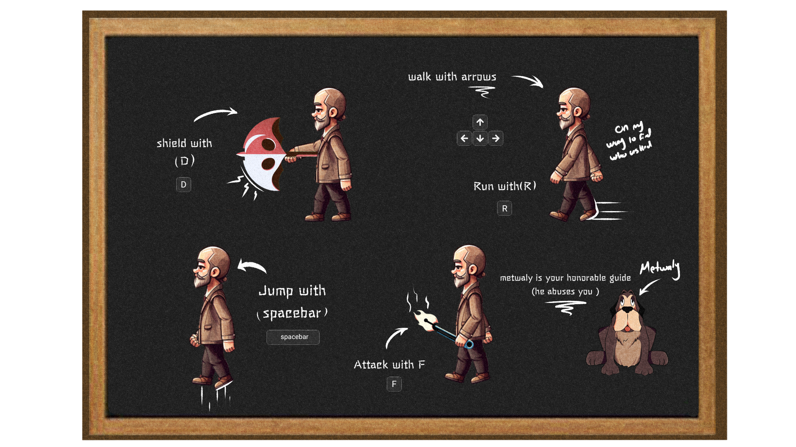

# Mystery Purse Documentation

](https://youtu.be/Ro3D7H7lKf8)


#### Last Updated: February 29th, 2024
## Table of Contents

1. [Story](#story)
2. [Installation](#installation)
3. [Gameplay](#gameplay)
4. [Acknowledgments](#acknowledgments)

<a name="story"></a>
## Story 



Taimor, a weary husband, returns home from a long day at work. While enjoying his dinner, his wife, Shafika, nags him for forgetting something important that day. Exhausted, he leaves and goes to relax in his room when he suddenly hears a sound. As he approaches her purse wearingly, he opens the purse and sticks his hand to find the source of the sound. That’s when an unexpected and bizarre event occurs. Taimor is inexplicably swallowed into the depths of the purse, encountering a surreal world filled with obstacles and adversaries—each one representing a unique item from within the purse. He soon finds himself in the purse’s lowest level, where he discovers the spirit of his old dog, Metwaly, who both guides and abuses him throughout the levels.
What was going to be another mundane afternoon turned into an escape became an action-packed night as Taimor fights way through purse-themed enemies like rouge, mascara, and pins, as he solves puzzles based on his relationship, spanning dates, vacations, and even a love letter to finally face his greatest foe – the one who soured his relationship with his wife, in a one-on-one confrontation that includes flip-flops thrown around violently.


<a name="installation"></a>
## Installation

Make sure you have [python](https://www.python.org/downloads/) downloaded if you haven't already.
Follow these steps to set up the environment and run the application:

1. Clone the Repository:
   
```bash
git clone https://github.com/Sambonic/Scrapedin
```

```bash
cd Scrapedin
```

2. Create a Python Virtual Environment:
```bash
python -m venv env
```

3. Activate the Virtual Environment:
- On Windows:
  ```
  env\Scripts\activate
  ```

- On macOS and Linux:
  ```
  source env/bin/activate
  ```
4. Ensure Pip is Up-to-Date:
  ```
  python.exe -m pip install --upgrade pip
  ```
5. Install Dependencies:

   ```bash
   pip install .
   ```


<a name="gameplay"></a>
## Gameplay



Open the project through unity.
Go to 
Game controls:
- Arrows for movement
- D for defense
- F for attack
- Spacebar for jump
- R for run
- Esc to pause
- C to show/hde controls


<br></br>
<a name="acknowledgments"></a>
# Acknowledgments
I want to extend my thanks to both of my teammates Amr and Abdelrahman for such an incredibly fulfilling team work. I also want to thank our TAs and module leader for the unconditional support and great experience throughout this whole module.


